# Diagrama de Flujo del Proceso

Este documento muestra el flujo visual completo del proceso de crítica de documentos.

## Diagrama de Flujo Principal

```mermaid
flowchart TD
    Start([Inicio]) --> Detect{¿Existe análisis previo?}
    Detect -->|No| InitVersion[Inicializar versión 1]
    Detect -->|Sí| ReadAnalysis[Leer análisis existente]
    ReadAnalysis --> ValidateGaps[Validar vigencia de gaps]
    ValidateGaps --> IncrementVersion[Incrementar versión]
    InitVersion --> Classify[Clasificar documento]
    IncrementVersion --> Classify

    Classify --> DetermineType[Determinar tipo de documento]
    Classify --> DetermineRoles[Determinar roles funcionales]
    Classify --> DeterminePerspectives[Determinar perspectivas senior/junior]

    DetermineType --> CheckGaps{¿Hay gaps previos?}
    DetermineRoles --> CheckGaps
    DeterminePerspectives --> CheckGaps

    CheckGaps -->|No| StartLoop[Iniciar bucle por rol]
    CheckGaps -->|Sí| EvaluatePrev[Evaluar gaps previos]

    EvaluatePrev --> UpdateStates[Actualizar estados de gaps]
    UpdateStates --> Deduplicate[Deduplicar gaps]
    Deduplicate --> StartLoop

    StartLoop --> SelectRole[Seleccionar rol funcional]
    SelectRole --> ValidatePhase[Fase A: Validación]

    ValidatePhase --> ReviewContext[Revisar contexto de gaps previos]
    ReviewContext --> ValidateAnswers[Validar respuestas existentes]
    ValidateAnswers --> CheckConsistency[Validar consistencia cruzada]
    CheckConsistency --> ResearchPhase[Fase B: Investigación]

    ResearchPhase --> IdentifyRefs[Identificar archivos de referencia]
    IdentifyRefs --> ReviewRefs[Revisar archivos de referencia]
    ReviewRefs --> CollectInfo[Recopilar información]
    CollectInfo --> IdentifyPhase[Fase C: Identificación]

    IdentifyPhase --> IdentifyMissing[Identificar contexto faltante]
    IdentifyMissing --> ApplyQuestions[Aplicar preguntas clave]
    ApplyQuestions --> AddRefs[Añadir referencias]
    AddRefs --> MoreRoles{¿Más roles?}

    MoreRoles -->|Sí| SelectRole
    MoreRoles -->|No| QualityEval[Evaluación de calidad]

    QualityEval --> RateDoc[Calificar documento 1-10]
    RateDoc --> Decision{Calificación ≥ 9?}

    Decision -->|Sí| SummaryOnly[Solo resumen de revisión]
    Decision -->|No| AddGaps[Agregar gaps al archivo]

    SummaryOnly --> FinalReview[Revisión final]
    AddGaps --> FinalReview

    FinalReview --> CheckCoverage[Verificar cobertura multi-rol]
    CheckCoverage --> CheckDual[Verificar perspectiva dual]
    CheckDual --> CheckContradictions[Identificar contradicciones]
    CheckContradictions --> ValidateGlobal[Validar completitud global]
    ValidateGlobal --> SuggestConsolidation[Sugerir consolidación temática]
    SuggestConsolidation --> End([Fin])
```

## Resumen de Pasos

1. **Detección de Análisis Previo**: Determinar si existe análisis previo y validar vigencia
2. **Preparación y Clasificación**: Clasificar tipo de documento, roles y perspectivas
3. **Evaluación de Gaps Previos**: Validar y actualizar estados de gaps existentes
4. **Validación de Respuestas y Consistencia**: Para cada rol, validar respuestas y consistencia cruzada
5. **Investigación de Referencias**: Para cada rol, revisar archivos de referencia
6. **Identificación de Contexto Faltante**: Para cada rol, identificar contexto faltante con preguntas clave
7. **Evaluación de Calidad**: Calificar documento y decidir adición de gaps
8. **Revisión Final**: Verificar cobertura, consistencia y criterios de terminación
