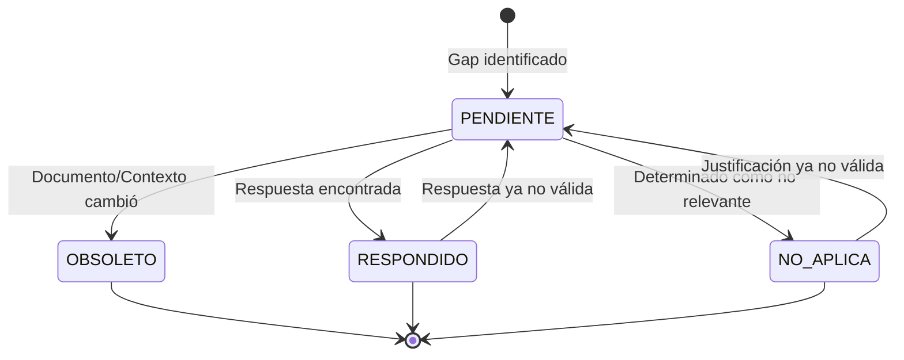

# Transiciones de Estado de Gaps

Este documento describe las transiciones posibles entre los estados de un gap y los criterios para cada transición.

## Estados de Gaps Manejados por document-critique

- **[PENDIENTE]**: Gap que requiere respuesta o investigación
- **[RESPONDIDO]**: Gap que ha sido respondido con información válida y referencias
- **[NO APLICA]**: Gap que no es relevante para el documento o contexto actual (con justificación)
- **[OBSOLETO]**: Gap que ya no es relevante debido a cambios en el documento o contexto

## Estados de Gaps Manejados por Otros Skills

Los siguientes estados son manejados por otros skills en el flujo del sistema:

- **[RESUELTO]**: Gap cuya respuesta ha sido validada como adecuada por gap-resolution (manejado por gap-resolution)
- **[PLANEADO]**: Gap con acción de integración propuesta por actions-proposal (manejado por actions-proposal)
- **[IMPLEMENTADO]**: Gap cuya acción de integración ha sido ejecutada por document-editing (manejado por document-editing)

Para más información sobre el flujo completo de estados, consultar el flujo de ejecución del sistema en actions-proposal.

## Diagrama de Transiciones

## Transiciones Detalladas

### [PENDIENTE] → [RESPONDIDO]

**Criterios**:

1. Se encontró respuesta explícita en nueva documentación
2. El código ahora incluye comentarios que explican el por qué
3. Se agregó una referencia que responde la pregunta directamente
4. Un documento relacionado fue creado que contiene la respuesta

**Acción requerida**:

- Documentar la respuesta encontrada
- Incluir referencias fuente específicas
- Actualizar fecha de resolución

### [PENDIENTE] → [NO APLICA]

**Criterios**:

1. El gap no es relevante para el tipo de documento actual
2. El rol afectado ya no aplica al contexto
3. La pregunta no tiene sentido dado el propósito del documento

**Acción requerida**:

- Documentar justificación clara de por qué no aplica
- Incluir fecha de evaluación
- Incluir versión del análisis

### [PENDIENTE] → [OBSOLETO]

**Criterios**:

1. El documento cambió significativamente en la sección relacionada con el gap
2. El contexto de negocio evolucionó (nuevos requisitos, cambio de estrategia)
3. La tecnología mencionada fue reemplazada o deprecated
4. El rol afectado ya no aplica (cambio de equipo, reestructuración)
5. La pregunta ya no tiene sentido dado el estado actual del proyecto

**Acción requerida**:

- Documentar el cambio que causó la obsolescencia
- Incluir fecha de evaluación
- Incluir versión del análisis

### [RESPONDIDO] → [PENDIENTE]

**Criterios**:

1. La respuesta ya no es correcta dado el estado actual del documento
2. La referencia fuente fue actualizada o corregida
3. El contexto de negocio cambió invalidando la respuesta

**Acción requerida**:

- Documentar por qué la respuesta ya no es válida
- Mantener la respuesta anterior como referencia histórica
- Actualizar fecha de revisión

### [NO APLICA] → [PENDIENTE]

**Criterios**:

1. La justificación de "no aplica" ya no es válida
2. El contexto del documento cambió haciéndolo relevante
3. El rol afectado ahora aplica al contexto

**Acción requerida**:

- Documentar por qué ahora es relevante
- Mantener la justificación anterior como referencia
- Actualizar fecha de revisión

## Reglas de Gestión de Estado

### Validación de Vigencia

En cada análisis previo, validar que:

- Los gaps `[PENDIENTE]` siguen siendo relevantes
- Las respuestas `[RESPONDIDO]` siguen siendo correctas
- Las justificaciones `[NO APLICA]` siguen siendo válidas

### Acumulación de Contexto

Los gaps con estado `[RESPONDIDO]` y `[NO APLICA]` deben:

- Ser revisados para entender el contexto del documento
- Utilizarse como referencia para evitar re-detección
- Mantenerse como contexto para evaluaciones posteriores

### Deduplicación

Al identificar nuevos gaps:

- Comparar con gaps existentes en todos los estados
- Si es duplicado, actualizar el gap existente
- Documentar la actualización con fecha y versión
