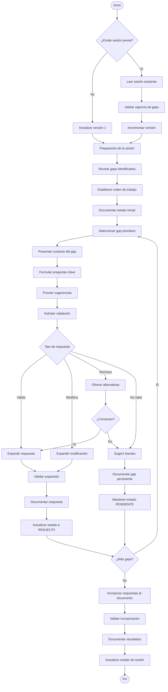

# Diagrama de Flujo del Proceso

Este documento muestra el flujo visual completo del proceso de resolución de gaps.

## Diagrama de Flujo Principal

## Resumen de Pasos

1. **Detección de Sesión Previo**: Determinar si existe sesión previa y validar vigencia
2. **Preparación de la Sesión**: Revisar gaps, establecer orden de trabajo, documentar estado inicial
3. **Rondas de Preguntas**: Para cada gap, presentar contexto, formular preguntas, proveer sugerencias
4. **Manejo de Respuestas**: Expandir respuestas validadas, manejar rechazos, documentar gaps persistentes
5. **Documentación de Resultados**: Incorporar respuestas al documento, validar incorporación, actualizar estado de sesión
