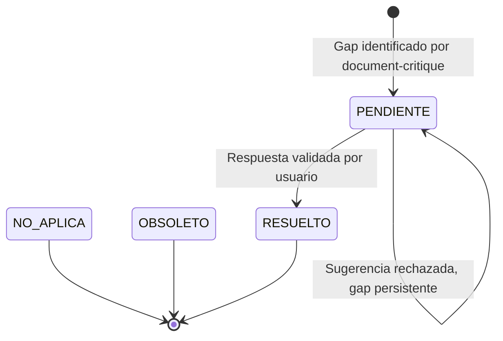

# Transiciones de Estado de Gaps en Gap Resolution

Este documento describe las transiciones posibles entre los estados de un gap durante una sesión de gap-resolution y los criterios para cada transición.

## Estados de Gaps

- **[PENDIENTE]**: Gap identificado por document-critique que requiere resolución colaborativa
- **[RESUELTO]**: Gap que ha sido resuelto con validación explícita del usuario
- **[NO APLICA]**: Gap marcado como no relevante por document-critique (no modificar)
- **[OBSOLETO]**: Gap marcado como obsoleto por document-critique (no modificar)

## Diagrama de Transiciones

## Transiciones Detalladas

### [PENDIENTE] → [RESUELTO]

**Criterios**:

1. El usuario validó explícitamente una sugerencia o propuesta
2. El usuario proporcionó una respuesta directa
3. El usuario modificó una sugerencia y validó el resultado
4. Se estableció una definición o razonamiento con confirmación del usuario

**Acción requerida**:

- Documentar la respuesta validada con fecha
- Incluir referencias si el usuario proporcionó fuentes
- Actualizar estado a `[RESUELTO]`
- Incorporar la respuesta al documento original
- Actualizar el campo `gaps_resueltos` en frontmatter si aplica

### [PENDIENTE] → [PENDIENTE] (Gap Persistente)

**Criterios**:

1. El usuario rechazó todas las sugerencias
2. El usuario no tiene información para responder
3. El usuario solicita posponer la resolución
4. Se requiere investigación adicional fuera de la sesión

**Acción requerida**:

- Documentar como gap persistente con plan de acción
- Mantener estado `[PENDIENTE]`
- Incluir razón de persistencia
- Sugerir responsable o próximo paso

### [NO APLICA] → Sin Cambio

**Criterios**:

- Gap marcado como `[NO APLICA]` por document-critique
- No debe ser modificado por gap-resolution

**Acción requerida**:

- Omitir gap de la sesión
- No intentar resolverlo

### [OBSOLETO] → Sin Cambio

**Criterios**:

- Gap marcado como `[OBSOLETO]` por document-critique
- No debe ser modificado por gap-resolution

**Acción requerida**:

- Omitir gap de la sesión
- No intentar resolverlo

## Reglas de Gestión de Estado

### Solo Gaps PENDIENTE

gap-resolution solo debe trabajar con gaps en estado `[PENDIENTE]`:

- Ignorar gaps `[RESPONDIDO]` (ya resueltos)
- Ignorar gaps `[NO APLICA]` (no relevantes)
- Ignorar gaps `[OBSOLETO]` (obsoletos)

### Validación Explícita

Una transición a `[RESUELTO]` requiere validación explícita del usuario:

- "¿Estás de acuerdo con esta sugerencia?"
- "¿Esta respuesta es correcta?"
- "¿Quieres modificar algo?"

### Documentación de Cambios

Cada transición debe documentarse:

- Fecha de la transición
- Razón del cambio
- Respuesta o decisión del usuario
- Referencias si aplica

### Integración con document-critique

Después de gap-resolution, document-critique puede re-ejecutar para:

- Validar que los gaps resueltos están correctamente incorporados
- Verificar que no se introdujeron contradicciones
- Calificar el documento actualizado
- Identificar nuevos gaps si el contenido cambió significativamente
