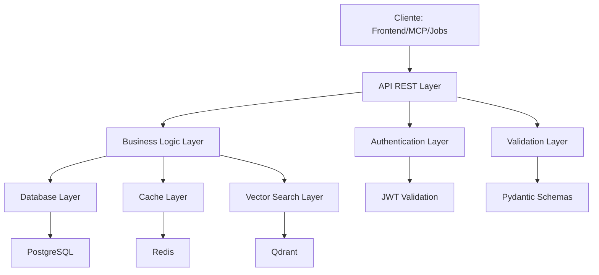

# API REST Specification — Alejandria

Este documento es el índice de la especificación de la API REST de Alejandria para MVP bootstrapped. La especificación está dividida en tres documentos para mejor organización:

- **[api-conventions.md](api-conventions.md)**: Convenciones generales (autenticación, validación, paginación, status codes)
- **[api-endpoints-specification.md](api-endpoints-specification.md)**: Especificación detallada de endpoints
- **[api-testing-logging.md](api-testing-logging.md)**: Estrategias de testing y logging

**Nota**: Esta especificación es para MVP bootstrapped sin frontend React. Frontend React se implementará en Hito 3.

---

## Índice

1. [Visión General](#1-visión-general)
2. [Decisiones Arquitectónicas de API](#2-decisiones-arquitectónicas-de-api)
3. [Documentos de la Especificación](#3-documentos-de-la-especificación)

---

## 1. Visión General

### Base URL

```text
Desarrollo: http://localhost:8000/api/v1
Producción: https://api.alejandria.com/api/v1
```

### Versioning de API

La API usa versioning en la URL. La versión actual es `v1`.

Para MVP bootstrapped, solo se mantiene versión v1. No se requieren cambios breaking en MVP.

### Formato de Datos

- **Request/Response**: JSON
- **Encoding**: UTF-8
- **Date Format**: ISO 8601 (YYYY-MM-DDTHH:MM:SSZ)

### Justificación de Arquitectura REST

REST + FastAPI fue elegido por ventajas técnicas específicas sobre GraphQL:

- Documentación automática con OpenAPI/Swagger (disponible en /docs) sin configuración adicional
- Caching HTTP nativo (ETag, Cache-Control) con proxies y CDNs estándar
- Mejor integración con herramientas estándar (Postman, curl, HTTP clients)
- Type safety con Pydantic para validación automática de requests/responses
- Simplicidad de debugging (requests HTTP estándar, fácil de tracear)

Para detalles completos de la justificación, ver [api-conventions.md](api-conventions.md).

---

## 2. Decisiones Arquitectónicas de API

### Selección de REST sobre GraphQL

La API REST fue seleccionada sobre GraphQL por las siguientes razones arquitectónicas:

**Documentación Automática**:
- FastAPI genera automáticamente especificación OpenAPI (Swagger/ReDoc)
- Facilita integración y descubrimiento de la API sin configuración adicional
- Disponible en `/docs` (Swagger UI) y `/redoc` (ReDoc)

**Caching HTTP Nativo**:
- REST aprovecha caching HTTP nativo (ETag, Cache-Control)
- Integración con proxies y CDNs estándar
- Mejor performance para endpoints de lectura frecuentes

**Type Safety y Validación**:
- Pydantic proporciona validación automática de requests/responses
- Type safety reduce bugs en tiempo de desarrollo
- Schema enforcement en tiempo de ejecución

**Simplicidad de Debugging**:
- Requests HTTP estándar fáciles de tracear con herramientas como curl, Postman
- Menor overhead de debugging comparado con GraphQL

Para detalles completos, ver [api-conventions.md](api-conventions.md).

### Estrategia de Versioning de API

**Estrategia Actual (MVP Bootstrapped)**:
- Solo se mantiene versión v1
- No se requieren cambios breaking en MVP
- URLs incluyen versión: `/api/v1/*`

**Estrategia Post-MVP**:
- Estrategia de deprecar versiones y mantener múltiples versiones simultáneamente se definirá en fases posteriores
- Consideraciones: backward compatibility, período de deprecation, comunicación de cambios breaking
- Documentación de migración para cambios breaking

**Criterios para Cambios Breaking**:
- Cambios en estructura de request/response que no son backward compatible
- Eliminación de endpoints existentes
- Cambios en semántica de campos existentes

Para detalles de convenciones de versioning, ver [api-conventions.md](api-conventions.md).

### Arquitectura de Capas de API



---

## 3. Documentos de la Especificación

### [api-conventions.md](api-conventions.md)

Define las convenciones generales de la API:

- **Convenciones HTTP**: Métodos, status codes, paginación, filtering, sorting
- **Autenticación y Autorización**: JWT Bearer Token, obtención de tokens, roles
- **Validación y Sanitización**: Framework de validación (Pydantic), sanitización de markdown, validaciones por entidad

### [api-endpoints-specification.md](api-endpoints-specification.md)

Define la especificación detallada de endpoints:

- **Documents**: CRUD completo, snapshots, restauración
- **Jobs**: Listar y reintentar jobs (admin/debugging)
- **Users**: Login
- **Health**: Health check de servicios

### [api-testing-logging.md](api-testing-logging.md)

Define las estrategias de testing y logging:

- **Error Handling**: Formato de errores, códigos de error, timeouts, retry strategy
- **Testing**: Estrategia de integration tests, cobertura crítica, manual testing con Swagger UI
- **Logging**: Logging estructurado con structlog, request ID, correlación de logs, SLAs de performance

---

## Referencias

- **[database-schema-design.md](database-schema-design.md)**: Diseño conceptual de esquema de base de datos
- **[ADR-002](../decisiones/adr-002-python-unified-stack.md)**: Stack unificado Python
- **[ADR-006](../decisiones/adr-006-document-versioning.md)**: Versioning de documentos
