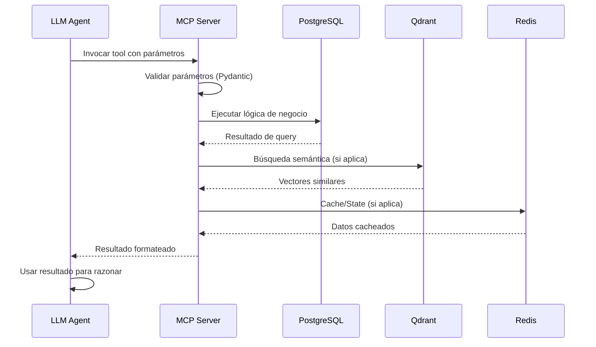

# MCP Server Architecture — Alejandria

---

Este documento define la arquitectura del MCP (Model Context Protocol) Server de Alejandria, incluyendo la estructura en capas, protocolo de comunicación, estrategia de versioning e integración con FastAPI. Para la especificación detallada de tools, ver [mcp-tools-specification.md](./mcp-tools-specification.md). Para deployment y testing, ver [mcp-deployment-testing.md](./mcp-deployment-testing.md).

---

## 1. Visión General

### Propósito

El MCP Server actúa como capa de abstracción entre los agentes LLM y el sistema Alejandria. Esta capa permite que los agentes interactúen con el sistema mediante tools estandarizadas sin conocer la implementación subyacente. Los agentes pueden leer y escribir documentos, gestionar gaps y propuestas, y ejecutar acciones específicas del dominio a través de una interfaz unificada.

### Beneficios

El uso de MCP como capa de abstracción proporciona ventajas estratégicas y técnicas:

- **Flexibilidad**: Permite cambiar de proveedores LLM (Qwen, Llama, etc.) sin reescribir código de integración, ya que la interfaz MCP es estándar
- **Estandarización**: Utiliza un protocolo abierto (Model Context Protocol) para comunicación con LLMs, garantizando interoperabilidad
- **Reducción de Vendor Lock-in**: Proporciona independencia de proveedores específicos mediante adopción de estándares abiertos
- **Consistencia**: Ofrece una interfaz unificada para todos los agentes, simplificando mantenimiento y evolución

### Stack Tecnológico

El MCP Server de Alejandria se implementa con las siguientes tecnologías:

- **Framework**: FastMCP (Python) - Framework simplificado para implementación de servidores MCP
- **Transporte**: HTTP (exclusivo) - Transporte HTTP para todos los entornos (desarrollo y producción)
- **LLM Provider**: Qwen 3.5 vía Ollama (MVP Bootstrapped) - Modelo LLM local para fase inicial
- **Integración**: FastAPI para endpoints HTTP adicionales - API REST complementaria para integraciones externas

**Justificación de FastMCP**:

FastMCP se eligió como framework de implementación de MCP Server por su integración nativa con el stack Python unificado (ADR-002), API minimalista que reduce boilerplate, soporte múltiple de transporte (stdio, HTTP, SSE), y ecosistema maduro. FastMCP es un wrapper sobre el MCP Python SDK oficial y se integra nativamente con Celery para ejecución asíncrona de tools, alineado con la estrategia de jobs efímeros (ADR-004).

Para detalles técnicos completos de la justificación de FastMCP, ver [ADR-001](../decisiones/adr-001-mcp-abstraction-layer.md) y [ADR-002](../decisiones/adr-002-python-unified-stack.md).

### Referencia

Para una justificación detallada del uso de MCP sobre alternativas como LangChain o integración directa con APIs, ver [ADR-001: Uso de MCP como Capa de Abstracción para LLM](../decisiones/adr-001-mcp-abstraction-layer.md).

---

## 2. Arquitectura del MCP Server

El MCP Server se organiza en dos capas principales que separan responsabilidades y facilitan mantenimiento. Esta arquitectura en capas permite evolución independiente de cada componente.

### Componentes

```text
┌─────────────────────────────────────────────────┐
│              MCP Server (FastMCP)               │
├─────────────────────────────────────────────────┤
│  Tools Layer                                    │
│  - read_document                                │
│  - write_document                               │
│  - list_gaps                                    │
│  - list_gaps_by_tag                             │
│  - create_gap                                   │
│  - answer_gap                                   │
│  - create_tag                                   │
│  - assign_tag_to_gap                            │
│  - list_proposals                               │
│  - create_proposal                              │
│  - accept_proposal                              │
│  - update_proposal_status                       │
│  - create_question                              │
│  - list_questions                               │
│  - answer_question                              │
│  - link_document_to_question                    │
│  - link_gap_to_question                         │
│  - search_similar_documents                     │
│  - get_gap_templates                            │
├─────────────────────────────────────────────────┤
│  Data Access Layer                              │
│  - PostgreSQL (via SQLAlchemy)                  │
│  - Qdrant (vector search)                       │
│  - Redis (cache)                                │
└─────────────────────────────────────────────────┘
```

### Flujo de Comunicación

La comunicación entre el LLM y el MCP Server sigue un flujo secuencial que garantiza validación, ejecución y retorno de resultados:

1. **LLM invoca tool MCP con parámetros**: El modelo de lenguaje solicita ejecución de una tool específica con los parámetros requeridos
2. **MCP Server valida parámetros**: El servidor verifica que los parámetros cumplan con el esquema definido para la tool
3. **MCP Server ejecuta lógica de negocio**: Se ejecuta la implementación de la tool, que puede incluir acceso a bases de datos o servicios externos
4. **MCP Server accede base de datos**: Si la tool requiere persistencia o retrieval, se accede a PostgreSQL, Qdrant o Redis según corresponda
5. **MCP Server retorna resultado a LLM**: El resultado se formatea según el esquema de respuesta de la tool y se envía al LLM
6. **LLM usa resultado para razonar y tomar decisiones**: El modelo incorpora el resultado en su contexto para continuar el razonamiento

### Diagrama de Secuencia de Comunicación



---

## 3. Protocolo de Comunicación

El MCP Server utiliza exclusivamente transporte HTTP para todos los entornos (desarrollo y producción). Esta decisión se tomó debido a problemas de compatibilidad entre FastMCP y los tipos de SQLAlchemy Session en pydantic-core cuando se usa transporte stdio.

### Transporte HTTP (Exclusivo)

El transporte HTTP se utiliza para todos los entornos por las siguientes razones:

**Razones del cambio de stdio a HTTP**:

1. **Compatibilidad FastMCP-SQLAlchemy**: El transporte stdio tenía problemas fundamentales con los tipos `Session` de SQLAlchemy en pydantic-core, causando errores de schema generation que impedían el funcionamiento del servidor MCP. Se resolvió eliminando los parámetros `session` de las firmas de las funciones MCP
2. **Autenticación API KEY nativa**: HTTP permite autenticación vía headers de forma estándar, ya implementada en el código para transporte HTTP
3. **Mejor integración con IDEs**: Los IDEs modernos (Devin IDE, Windsurf, Claude Code) tienen mejor soporte para servidores MCP HTTP
4. **Arquitectura más apropiada para producción**: HTTP es el estándar para servidores MCP en entornos de producción
5. **Evita problemas de tipos complejos**: HTTP no tiene las mismas limitaciones de schema generation que stdio

**Características**:

- Autenticación API KEY vía headers HTTP
- Soporte para CORS para integraciones web
- Mejor escalabilidad y balanceo de carga
- Compatible con clientes MCP HTTP estándar
- Logs y monitoreo más claros
- Servidor expuesto en `http://localhost:8000/mcp`

**Autenticación y Autorización**:

Para MVP Bootstrapped, el MCP Server implementa autenticación mediante API Keys:

- Generar API keys en tabla `api_keys` con `organization_id` y `user_id` para validar quién es el usuario que hace la request
- Validar API key en cada request HTTP
- No implementar roles por ahora (solo autenticación, sin autorización basada en roles)
- La API key se envía en el header `Authorization: Bearer <api_key>`

Esta estrategia permite autenticación simple para fase inicial sin la complejidad de sistemas de roles y permisos granulares.

### Manejo de Errores

El MCP Server maneja errores según la especificación JSON-RPC, retornando códigos de error estándar para problemas de protocolo y códigos personalizados para errores específicos del dominio. Los errores se clasifican en protocol errors (capturados por el cliente MCP) y tool execution errors (inyectados en contexto del LLM para recuperación).

**Categorías de Errores**:

El error handling se estructura en tres categorías según MCP Best Practices:

- **CLIENT_ERROR (4xx)**: Fault del cliente (ej: parámetros inválidos, documento no encontrado, permisos denegados)
- **SERVER_ERROR (5xx)**: Fault del servidor (ej: error de base de datos, timeout interno)
- **EXTERNAL_ERROR (502/503)**: Fault de dependencia externa (ej: LLM provider temporalmente sobrecargado)

**Errores Específicos por Tool**:

- `read_document`: DocumentNotFoundError
- `write_document`: DocumentNotFoundError, VersionConflictError
- `create_gap`: DocumentNotFoundError, ValidationError
- `answer_gap`: GapNotFoundError, GapAlreadyAnsweredError

**Arquitectura Stateless**:

El MCP Server es stateless y no implementa retry automático. El cliente LLM es responsable de reintentar tools cuando fallan. El MCP Server solo retorna códigos de error JSON-RPC apropiados para que el cliente decida si reintentar basándose en el tipo de error:

**Errores de MCP Server**:

```json
{
  "error": {
    "code": -32602,
    "message": "Invalid params: document_id is required"
  }
}
```

**Códigos de Error**:

- `-32600`: Invalid Request
- `-32601`: Method not found
- `-32602`: Invalid params
- `-32603`: Internal error
- `-32000`: Server error

---

## 4. Estrategia de Versioning

El MCP Server usa Semantic Versioning (SemVer) para versionar el servidor completo, alineado con best practices de MCP y el ecosistema Python. Esto permite evolución controlada mientras se mantiene compatibilidad backward con clientes LLM existentes.

### Formato de Versionado

El MCP Server sigue el formato `MAJOR.MINOR.PATCH` (ej: v1.0.0, v1.1.0, v2.0.0):

- **MAJOR**: Cambios breaking en tools o esquemas (ej: eliminar parámetros requeridos, cambiar formato de respuesta)
- **MINOR**: Cambios backward compatible (ej: agregar parámetros opcionales, nuevas tools)
- **PATCH**: Bug fixes sin cambios en la API pública

**Alineación con stack Python**:

- La versión se define en `server.json` para registro en MCP Registry
- Compatible con criterio de versionado de ADR-002 ("última versión estable menos un minor")
- Usa rangos semver en `pyproject.toml` para dependencias (ej: `fastmcp>=3.2.0,<3.3.0`)

### Compatibilidad Backward

Para mantener estabilidad del sistema y evitar breaking changes en clientes LLM:

- **Nunca eliminar parámetros requeridos** de tools existentes
- **Agregar parámetros opcionales** con default values es seguro (backward compatible)
- **Cambios breaking requieren nueva tool**: Si se requiere cambiar un esquema de forma breaking, crear una nueva tool con nombre diferente (ej: `read_document_v2`) y deprecar la anterior
- **Deprecation**: Mantener tools deprecadas por al menos una major version antes de eliminarlas
- **Documentación**: Documentar deprecation en responses de tools y en CHANGELOG.md

---

## 5. Integración con FastAPI

El MCP Server se integra con FastAPI mediante acceso directo a código compartido, no mediante comunicación HTTP. FastAPI y FastMCP se ejecutan como procesos separados pero comparten módulos Python, PostgreSQL y Redis, permitiendo que FastMCP acceda directamente a datos y lógica de negocio sin overhead de comunicación HTTP.

### Modelo de Comunicación

**Comunicación interna (FastMCP → Sistema)**:

- FastMCP accede directamente a módulos Python compartidos (services, repositories, schemas)
- PostgreSQL y Redis son compartidos entre FastAPI y FastMCP
- No hay comunicación HTTP entre FastAPI y FastMCP
- El shared state se maneja vía bases de datos compartidas

**Comunicación externa (FastAPI → Clientes)**:

- FastAPI expone endpoints HTTP REST para integraciones externas
- Estos endpoints son independientes de la interfaz MCP estándar
- Permiten que aplicaciones que no implementan clientes MCP invoquen funcionalidad del sistema

### Arquitectura de Integración

**Componentes**:

- FastAPI app principal (proceso separado)
- FastMCP server instance (proceso separado)
- Módulos Python compartidos (services, repositories, schemas)
- PostgreSQL compartido (persistencia)
- Redis compartido (cache y broker de colas)

**Flujo de datos**:

1. LLM invoca tool MCP vía protocolo MCP (stdio o HTTP)
2. FastMCP ejecuta lógica de negocio accediendo directamente a módulos compartidos
3. Módulos compartidos acceden PostgreSQL/Redis según requerimientos
4. FastMCP retorna resultado al LLM vía protocolo MCP

### Endpoints HTTP Externos (Opcional)

FastAPI puede exponer endpoints HTTP REST para integraciones externas que no usan MCP. Estos endpoints son independientes del MCP Server y delegan a los mismos módulos compartidos que usa FastMCP.
