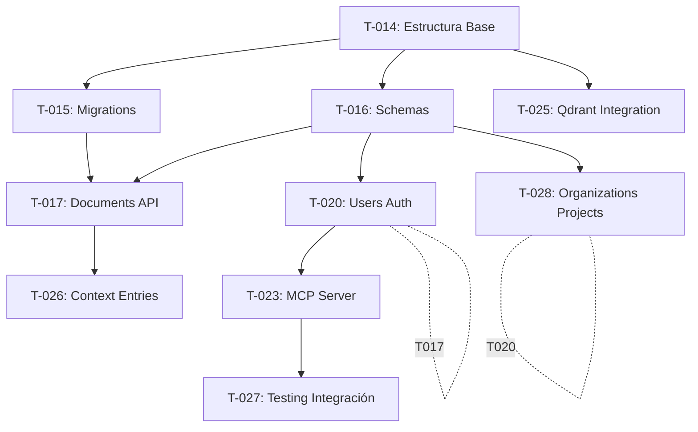

# Epica 2: API REST y MCP Server Básico

**Estado**: ✅ COMPLETADO

**Objetivo**: Implementar la API REST básica con FastAPI y el MCP Server usando FastMCP.

---

## Referencias

- **[../../estrategia/estrategia/technical-roadmap.md](../../estrategia/estrategia/technical-roadmap.md)**: Roadmap técnico, Hito 2
- **[../propuestas/trd-milestone-2-api-rest.md](../propuestas/trd-milestone-2-api-rest.md)**: TRD Hito 2 - API REST (TRD-021)
- **[../propuestas/trd-milestone-2-mcp-server.md](../propuestas/trd-milestone-2-mcp-server.md)**: TRD Hito 2 - MCP Server (TRD-022)
- **[../propuestas/trd-milestone-2-integrations.md](../propuestas/trd-milestone-2-integrations.md)**: TRD Hito 2 - Integraciones (TRD-023)
- **[../../producto/requisitos/prd-hito-02-api-mcp.md](../../producto/requisitos/prd-hito-02-api-mcp.md)**: PRD Hito 2
- **[../arquitectura/technology-stack.md](../arquitectura/technology-stack.md)**: Stack tecnológico
- **[../arquitectura/api-specification.md](../arquitectura/api-specification.md)**: Especificación de API REST
- **[../arquitectura/mcp-server-architecture.md](../arquitectura/mcp-server-architecture.md)**: Arquitectura de MCP Server (ARC-030)
- **[../arquitectura/mcp-tools-specification.md](../arquitectura/mcp-tools-specification.md)**: Tools de MCP (ARC-036)
- **[../arquitectura/api-testing-logging.md](../arquitectura/api-testing-logging.md)**: Testing y Logging (ARC-040)
- **[../arquitectura/mcp-server-data-consistency-concurrency.md](../arquitectura/mcp-server-data-consistency-concurrency.md)**: Consistencia y Concurrency (ARC-037)
- **[../arquitectura/mcp-server-performance-scalability.md](../arquitectura/mcp-server-performance-scalability.md)**: Performance y Escalabilidad (ARC-038)
- **[../arquitectura/mcp-server-observability-monitoring.md](../arquitectura/mcp-server-observability-monitoring.md)**: Observabilidad y Monitoreo (ARC-039)
- **[../arquitectura/mcp-deployment-testing.md](../arquitectura/mcp-deployment-testing.md)**: Deployment y Testing de MCP (ARC-032)
- **[../arquitectura/database-schema-design.md](../arquitectura/database-schema-design.md)**: Diseño de schema
- **[../decisiones/adr-001-mcp-abstraction-layer.md](../decisiones/adr-001-mcp-abstraction-layer.md)**: ADR-001
- **[../decisiones/adr-002-python-unified-stack.md](../decisiones/adr-002-python-unified-stack.md)**: ADR-002

- **[../decisiones/adr-006-document-versioning.md](../decisiones/adr-006-document-versioning.md)**: ADR-006

---

## Componentes

- FastAPI con endpoints básicos
- MCP Server implementado con FastMCP (sincrónico para MVP bootstrapped)
- Integración con Qdrant
- Sistema de autenticación JWT

### Contexto de MCP y FastMCP

**MCP (Model Context Protocol)** es un protocolo estandarizado para conectar LLMs con herramientas externas y datos, permitiendo cambio de proveedores sin reescribir código.

**FastMCP** es un framework Python que simplifica la implementación de servidores MCP con abstracciones de alto nivel, reduciendo la complejidad de implementación comparado con MCP estándar.

Para detalles completos, consultar: ADR-001 (justificación de MCP), mcp-server-architecture.md (beneficios y arquitectura), mcp-tools-specification.md (tools), mcp-deployment-testing.md (deployment y testing), technology-stack.md (definición de FastMCP).

---

## Técnicas Individuales

### Estimación de Esfuerzo Total

**Estimación total**: ~45 horas

Desglose por tarea:

- T-014: 2h
- T-015: 3h
- T-016: 4h
- T-017: 6h
- T-020: 5h
- T-028: 4h
- T-023: 10h
- T-025: 5h
- T-026: 2h
- T-027: 8h

Nota: Estimaciones detalladas están en tareas individuales. Las estimaciones están basadas en experiencia previa del desarrollador. No hay un criterio estandarizado documentado para todas las estimaciones; implementation-strategy.md menciona estimación de esfuerzo pero no detalla la metodología específica.

**Criterio de Estimación**:

Para MVP bootstrapped, las estimaciones se basan en:
- Experiencia previa del desarrollador con stack Python (FastAPI, SQLAlchemy, FastMCP)
- Complejidad de integración entre componentes
- Complejidad de configuración de infraestructura (Docker Compose, Qdrant, Ollama)
- Riesgo técnico de cada componente

**Rangos de referencia**:
- Configuración básica (T-014, T-015): 2-3h
- Implementación de schemas y endpoints simples (T-016, T-020): 3-5h
- Integración compleja (T-017, T-023, T-027): 4-8h
- Testing y validación (T-025, T-026): 2-5h

Post-MVP: Se implementará methodology de estimación más formal (Story Points, Planning Poker).

### Justificación del Orden de Tareas

El orden de tareas se basa en dependencias secuenciales y valor crítico. Según implementation-strategy.md, las tareas se ordenan según dependencias y valor crítico.

**Dependencias Explícitas**:
- T-014 (estructura base) es prerequisito para T-015, T-016, T-025 (requieren estructura de proyecto)
- T-015 (migrations) es prerequisito para T-017 (requiere schema de base de datos)
- T-016 (schemas) es prerequisito para T-017, T-020, T-028, T-027 (requieren validación de datos)
- T-017 (documents) es prerequisito para T-026 (requiere endpoints de documentos)
- T-023 (MCP Server) es prerequisito para T-027 (requiere MCP Server para testing de integración)

**Paralelización Posible**:
- T-025 puede ejecutarse en paralelo después de T-014 (no depende de otras tareas)
- T-020 puede ejecutarse en paralelo después de T-016 (no depende de T-017)
- T-028 puede ejecutarse en paralelo después de T-016 (no depende de T-017)

**Flujo Lógico**:
1. Infraestructura base (T-014)
2. Persistencia de datos (T-015, T-016)
3. Core functionality (T-017, T-020, T-028)
4. Integración MCP (T-023)
5. Testing e integración (T-025, T-026, T-027)

### Estrategia de Rollback y Gestión de Riesgos

Para cambios en base de datos, ADR-006 define rollback de snapshots y migrations backwards-compatible con downgrade scripts. Para cambios en código, Git se usa para rollback a commits anteriores. Para cambios en infraestructura Docker Compose, se puede recrear servicios desde cero. No hay checkpoints explícitos documentados para tareas a mitad de implementación; la estrategia es validar cada tarea completamente antes de proceder a la siguiente según implementation-strategy.md ("Testing continuo: Validar cada tarea antes de proceder a la siguiente").

### Validación de Tareas

Cada tarea tiene "Criterios de Aceptación" específicos que deben validarse manualmente. Algunas tareas incluyen validación automatizada (ej: T-002: "Comando `docker-compose config` valida configuración sin errores", T-005: "Migration aplica sin errores y crea todas las tablas"). implementation-strategy.md establece "Testing continuo: Validar cada tarea antes de proceder a la siguiente". Para T-027 específicamente, se implementan unit tests e integration tests con pytest. No hay un framework de validación automatizado estandarizado para todas las tareas; la validación es principalmente manual basada en los criterios de aceptación de cada tarea.

### T-014: Configurar Estructura de Proyecto Python

**Descripción**: Crear estructura base del proyecto Python con FastAPI, configurar dependencias con uv y establecer convenciones de código. Ruff para linting y formatting (reemplaza Black, isort, flake8). Configuración recomendada: line-length=88, select=[E, F, I, N, W, UP, B], formatter con quote-style=double, indent-style=space, docstring-code-format=true. Type hints requiere mypy separado si se desea type checking. Ver detalles en archivo de tarea individual.

**Criterios de Aceptación**:

- [ ] Estructura de directorios configurada
- [ ] pyproject.toml configurado con dependencias
- [ ] uv lock file generado
- [ ] README con instrucciones de setup

**Dependencias**: Ninguna

**Estado**: ✅ COMPLETADO

---

### T-015: Configurar Database Migrations con Alembic

**Descripción**: Configurar Alembic para migrations de base de datos según schema definido en database-schema-design.md. Ver detalles en archivo de tarea individual.

**Criterios de Aceptación**:

- [ ] Alembic 1.17.0 configurado
- [ ] Migration inicial crea todas las tablas del schema
- [ ] Middleware de versioning automático implementado según ADR-006

**Dependencias**: T-014

**Estado**: ✅ COMPLETADO

---

### T-016: Implementar Pydantic Schemas

**Descripción**: Implementar schemas Pydantic para validación de request/response de API según api-specification.md. Incluye sanitización de input con Bleach para markdown. Ver detalles en archivo de tarea individual.

**Criterios de Aceptación**:

- [ ] Schemas para Document, Gap, User implementados
- [ ] Validación de input según especificación
- [ ] Sanitización de markdown con Bleach implementada (whitelist conservativa: tags p, br, strong, em, u, code, pre, blockquote, ul, ol, li, h1-h6, a; atributos permitidos: a: href con http/https, title; code: class para syntax highlighting; protocolos: http, https)

**Dependencias**: T-014

**Estado**: ✅ COMPLETADO

---

### T-017: Implementar API Endpoints - Documents

**Descripción**: Implementar endpoints CRUD para documentos según api-specification.md. Ver detalles en archivo de tarea individual.

**Criterios de Aceptación**:

- [ ] Endpoints CRUD para documentos implementados
- [ ] Manejo de concurrencia con pessimistic locking
- [ ] Versioning de snapshots implementado

**Dependencias**: T-015, T-016

**Estado**: ✅ COMPLETADO

---

### T-020: Implementar API Endpoints - Users y Auth

**Descripción**: Implementar endpoints básicos para usuarios y autenticación JWT básica para MVP. Ver detalles en T-020-implementar-api-endpoints-users-auth.md.

**Criterios de Aceptación**:

- [ ] Endpoints de registro y login implementados
- [ ] JWT básico implementado (sin refresh tokens)
- [ ] Expiración de tokens: 8 horas

**Dependencias**: T-016

**Estado**: ✅ COMPLETADO

---

### T-028: Implementar API Endpoints - Organizations y Projects

**Descripción**: Implementar endpoints CRUD básicos para organizaciones y proyectos según api-specification.md. Ver detalles en T-028-implementar-api-endpoints-organizations-projects.md.

**Criterios de Aceptación**:

- [ ] Endpoints CRUD para organizaciones implementados (create, list, get)
- [ ] Endpoints CRUD para proyectos implementados (create, list, get)
- [ ] Validación de slug uniqueness implementada
- [ ] Relación usuario-organización-proyecto implementada

**Dependencias**: T-016

**Estado**: ✅ COMPLETADO

---

### T-023: Implementar MCP Server con FastMCP

**Descripción**: Implementar MCP Server con tools según mcp-tools-specification.md. Ver detalles en T-023-implementar-mcp-server-fastmcp.md.

**Criterios de Aceptación**:

- [ ] MCP Server implementado con FastMCP 3.2.0
- [ ] Tools implementados según especificación
- [ ] Transporte stdio para desarrollo local
- [ ] Integración con PostgreSQL, Qdrant, Redis
- [ ] Autenticación via API KEY para identificar usuario que usa MCP (necesario incluso en transporte stdio)
- [ ] Tabla api_keys implementada para gestión de API keys

**Dependencias**: T-015

**Estado**: ✅ COMPLETADO

---

### T-025: Implementar Integración con Qdrant

**Descripción**: Implementar cliente HTTP para comunicación con Qdrant y operaciones vectoriales. BGE-M3 se ejecuta vía Ollama para MVP bootstrapped (API externa para producción). Incluye estrategia de re-indexación incremental cuando documentos cambian. Ver detalles en archivo de tarea individual.

**Criterios de Aceptación**:

- [ ] Cliente HTTP para API de Qdrant
- [ ] Funciones para crear colecciones, insertar vectores, buscar por similitud
- [ ] Estrategia de chunking implementada
- [ ] BGE-M3 configurado vía Ollama (API: `curl http://localhost:11434/api/embeddings -d '{"model": "bge-m3", "prompt": "texto"}'`)
- [ ] Estrategia de actualización de vectores implementada (trigger: evento de actualización de documento; re-indexación incremental: eliminar vectores existentes, aplicar chunking al contenido actualizado, generar embeddings, insertar vectores con metadata, actualizar vector_sync_log)

**Dependencias**: T-014

**Estado**: ✅ COMPLETADO

---

### T-026: Implementar Health Checks

**Descripción**: Implementar endpoint de health check para verificar estado de servicios. Ollama se ejecuta fuera de Docker (en el host o máquina remota) según ADR-003, conectado mediante Tailscale. Health check de Ollama verifica conectividad vía `/api/version` usando la URL de Tailscale configurada en OLLAMA_URL.

**Criterios de Aceptación**:

- [ ] GET /api/v1/health implementado
- [ ] Health check verifica PostgreSQL, Redis, Qdrant
- [ ] Health check verifica Ollama vía Tailscale (endpoint `/api/version`)
- [ ] Health check retorna JSON con estado de cada servicio

**Dependencias**: T-017

**Estado**: ✅ COMPLETADO

---

### T-027: Implementar Testing Básico

**Descripción**: Implementar unit tests básicos para componentes principales. Integration tests usan bases de datos reales separadas en docker-compose (POSTGRES_TEST_DB y REDIS_TEST_URL). Testing de MCP servers usa FastMCP Client in-memory. Ver detalles en T-027-implementar-testing-basico.md.

**Criterios de Aceptación**:

- [ ] pytest configurado
- [ ] Unit tests para Pydantic schemas
- [ ] Unit tests para services de negocio
- [ ] Integration tests con bases de datos separadas en docker-compose (POSTGRES_TEST_DB y REDIS_TEST_URL)
- [ ] Testing de MCP servers con FastMCP Client in-memory
- [ ] Cobertura >70% objetivo inicial

**Dependencias**: T-016, T-023

**Estado**: ✅ COMPLETADO
