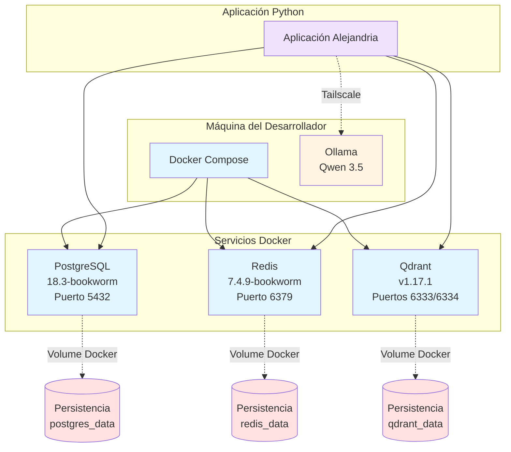

# PRD: Hito 1 - Infraestructura Base — Alejandria

Este documento define los requisitos del producto para el Hito 1: Infraestructura Base del MVP Bootstrapped.

---

## Índice

1. [Visión General](#1-visión-general)
2. [Objetivo del Hito](#2-objetivo-del-hito)
3. [Componentes del Hito](#3-componentes-del-hito)
4. [Requisitos Funcionales](#4-requisitos-funcionales)
5. [Requisitos No Funcionales](#5-requisitos-no-funcionales)
6. [Criterios de Aceptación](#6-criterios-de-aceptación)
7. [Dependencias](#7-dependencias)

---

## 1. Visión General

**Propósito:**

Configurar la infraestructura base necesaria para el desarrollo local del sistema Alejandria, estableciendo los servicios fundamentales que soportarán todas las funcionalidades posteriores. Esta infraestructura proporciona un entorno consistente y reproducible que elimina variaciones entre máquinas de desarrolladores, mitigando problemas de "funciona en mi máquina" y acelerando el ciclo de desarrollo.

**Contexto:**

Este es el hito inicial del roadmap técnico y representa la fundación sobre la cual se construye todo el sistema. Configura la infraestructura base (Docker Compose, PostgreSQL, Redis, Qdrant, Ollama) que será utilizada por todos los hitos subsiguientes. Sin esta infraestructura, no es posible desarrollar ni probar ninguna funcionalidad del sistema. La decisión de configurar todos estos servicios desde el inicio, aunque algunos no se utilicen plenamente hasta hitos posteriores, garantiza que el entorno de trabajo esté completo y evita interrupciones por falta de dependencias críticas.

---

## 2. Objetivo del Hito

**Objetivo Principal:**

Configurar infraestructura base para desarrollo local que permita:

- Orquestación de servicios con Docker Compose
- Persistencia de datos con PostgreSQL
- Cola de mensajes y cache con Redis
- Búsqueda semántica con Qdrant
- Ejecución de LLM local con Ollama

**Valor:**

Establecer una base sólida y reproducible para el desarrollo, garantizando que todos los desarrolladores tengan el mismo entorno y que la infraestructura esté lista para los hitos posteriores. Este enfoque reduce significativamente el tiempo de onboarding para nuevos miembros del equipo, ya que pueden levantar el entorno completo siguiendo la documentación sin dependencia de otros desarrolladores. Además, la infraestructura local permite iterar rápidamente sobre funcionalidades sin los costos y latencias asociados con servicios en la nube, acelerando el ciclo de trabajo y validación de hipótesis.

---

## 3. Componentes del Hito

### Diagrama de Arquitectura de Hito 1

**Notas del diagrama**:

- Docker Compose orquesta PostgreSQL, Redis y Qdrant como contenedores
- Ollama se ejecuta fuera de Docker, conectado vía Tailscale (línea punteada)
- La aplicación Python se conecta a todos los servicios
- Volumes Docker aseguran persistencia de datos a través de reinicios
- Todos los servicios corren en la máquina del desarrollador para MVP Bootstrapped

### 3.1 Docker Compose

**Descripción:**

Docker Compose actúa como el orquestador central de toda la infraestructura local. Este archivo de configuración define cómo se levantan, conectan y mantienen todos los servicios necesarios para Alejandria. Al encapsular la configuración de cada servicio en un solo archivo, Docker Compose asegura que todos los desarrolladores trabajen con el mismo entorno, eliminando variaciones que podrían causar problemas de reproducibilidad.

**Valor de Negocio:**

Docker Compose reduce significativamente el tiempo de onboarding de nuevos desarrolladores al proporcionar un entorno consistente y reproducible. Un desarrollador nuevo puede levantar toda la infraestructura con un solo comando, eliminando la necesidad de configurar servicios nativamente en cada máquina. Esto alinea con el principio de "Baja Fricción" y permite iteración rápida sobre funcionalidades sin interrupciones por falta de dependencias críticas.

**Requisitos:**

- Docker Compose debe levantar todos los servicios sin errores
- Servicios deben estar configurados con networking apropiado
- Volúmenes deben estar configurados para persistencia de datos
- Variables de entorno deben estar centralizadas

**Nota:** Para detalles técnicos específicos (versiones de imágenes, configuración de puertos, health checks), ver TRD-001. Para justificación de la decisión de usar Docker Compose, ver ADR-003.

### 3.2 PostgreSQL

**Descripción:**

PostgreSQL sirve como la base de datos relacional principal del sistema, encargada de persistir todos los datos estructurados de Alejandria. Para el entorno local, PostgreSQL se ejecuta en un contenedor Docker con persistencia de datos, asegurando que la información sobreviva a reinicios del contenedor y permitiendo un flujo de trabajo continuo sin pérdida de datos.

**Valor de Negocio:**

PostgreSQL proporciona integridad transaccional ACID crítica para mantener la consistencia de datos en el sistema de documentación. La persistencia de datos a través de reinicios asegura que el trabajo de los desarrolladores no se pierda por eventos normales, reduciendo la fricción en el flujo de trabajo y permitiendo iteración continua sin interrupciones.

**Requisitos:**

- PostgreSQL local debe aceptar conexiones
- Schema inicial debe estar versionado (migrations)
- Usuario y contraseña deben estar configurados
- Base de datos debe ser persistente a través de reinicios de contenedor

**Nota:** Para detalles técnicos específicos (versión, configuración de migrations, estrategia de rollback), ver TRD-001.

### 3.3 Redis

**Descripción:**

Redis funciona como el sistema de cola de mensajes y cache para procesamiento asíncrono en Alejandria. Este componente es crítico para desacoplar operaciones que no requieren ejecución inmediata, permitiendo que la aplicación responda rápidamente mientras tareas pesadas se procesan en segundo plano. Redis también proporciona capacidades de cache para mejorar el rendimiento de operaciones frecuentes.

**Valor de Negocio:**

Redis como broker de mensajes permite escalabilidad del sistema al procesar tareas pesadas (análisis de documentos con LLM) de forma asíncrona sin bloquear la aplicación principal. Como cache, reduce la latencia de operaciones frecuentes, mejorando la experiencia del usuario y optimizando el uso de recursos. El rol dual (broker + cache) simplifica la infraestructura al usar un solo servicio para dos propósitos.

**Requisitos:**

- Redis local debe aceptar conexiones como broker
- Configuración de persistencia (si aplica)

**Nota:** Para detalles técnicos específicos (versión, configuración AOF, rol dual como broker/cache), ver TRD-001.

### 3.4 Qdrant

**Descripción:**

Qdrant es la base de datos vectorial seleccionada para habilitar búsqueda semántica en Alejandria. A diferencia de bases de datos tradicionales que buscan por coincidencia exacta, Qdrant permite encontrar contenido basado en similitud semántica mediante embeddings vectoriales. Esta capacidad es fundamental para funcionalidades como la búsqueda inteligente de preguntas y agrupación de contenido similar. Aunque su uso principal se materializa en hitos posteriores, Qdrant se configura en Hito 1 como parte de la infraestructura base para asegurar que el entorno de trabajo esté completo desde el inicio.

**Valor de Negocio:**

Qdrant habilita el valor de "Contexto Acumulativo" al permitir encontrar y reutilizar respuestas previas basadas en similitud semántica, no solo coincidencia exacta de palabras. Esto crea un repositorio de conocimiento que crece orgánicamente con el tiempo, donde cada resolución de gap se convierte en un activo reutilizable. Configurarlo desde el inicio asegura que la infraestructura de búsqueda semántica esté lista cuando se necesite en cualquier fase del workflow, evitando interrupciones por falta de dependencias críticas.

**Requisitos:**

- Qdrant local debe aceptar conexiones
- Debe permitir crear colecciones
- Configuración de persistencia de vectores
- API de Qdrant debe ser accesible desde aplicación Python

**Nota:** Qdrant se configura en Hito 1 como infraestructura base porque se necesita en Hito 2 para la Sección de Preguntas (transformación de respuestas a vectores) y en Hito 4 para búsqueda semántica. Para detalles técnicos específicos (versión, configuración de colecciones, métricas de distancia), ver TRD-001.

### 3.5 Ollama

**Descripción:**

Ollama es la plataforma que permite ejecutar modelos de lenguaje grande (LLMs) localmente, eliminando la dependencia de servicios externos y reduciendo costos operativos. Para Alejandria, Ollama ejecuta el modelo Qwen 3.5, que proporciona capacidades de procesamiento de lenguaje natural para tareas como generación de respuestas, análisis de contenido y transformación de texto. La ejecución local ofrece ventajas significativas en privacidad, latencia y control sobre el modelo.

**Valor de Negocio:**

Ollama permite desarrollo local sin costos de API, lo cual es crítico para la fase MVP Bootstrapped con recursos limitados. La ejecución local reduce latencia comparado con servicios cloud, mejorando la experiencia de desarrollo. Además, proporciona privacidad total al procesar datos sensibles de documentación sin enviarlos a servicios externos. MCP como capa de abstracción permite cambiar de proveedor fácilmente si Ollama no funciona bien, mitigando el riesgo de lock-in tecnológico.

**Requisitos:**

- Ollama debe estar instalado y funcionando
- Modelo Qwen 3.5 debe estar descargado
- Ollama debe responder a prompts con Qwen 3.5
- API de Ollama debe ser accesible desde aplicación Python

**Nota:** Para detalles técnicos específicos (configuración de Tailscale, ejecución fuera de Docker), ver TRD-001.

---

## 4. Requisitos Funcionales

### 4.1 Orquestación de Servicios

La orquestación de servicios mediante Docker Compose es fundamental para simplificar el flujo de trabajo. Al permitir levantar toda la infraestructura con un solo comando, se reduce la fricción para nuevos desarrolladores y se asegura que el entorno esté siempre disponible. Los health checks aseguran que los servicios estén listos antes de que la aplicación intente conectarse, evitando errores de conexión durante el inicio. El acceso centralizado a logs facilita el debugging y monitoreo del sistema.

**Requisitos:**

- Docker Compose debe levantar todos los servicios (PostgreSQL, Redis, Qdrant, Ollama) con un solo comando
- Servicios deben iniciar en el orden correcto considerando dependencias
- Servicios deben tener health checks configurados
- Logs de todos los servicios deben estar accesibles
- Comandos operativos: `docker-compose up -d` (levantar), `docker-compose down` (detener), `docker-compose restart <service>` (reiniciar servicio), `docker-compose logs <service>` (ver logs)

**Nota:** Para detalles técnicos específicos (configuración de health checks, orden de inicio, comandos), ver TRD-001.

### 4.2 Configuración de Base de Datos

La configuración de base de datos requiere un enfoque sistemático para manejar cambios en el schema a lo largo del tiempo. El versionado de migrations con Alembic asegura que evoluciones del schema sean reproducibles y reversibles, permitiendo a los desarrolladores sincronizar sus bases de datos locales con el estado esperado. La estrategia de versionado utiliza migrations backwards-compatible con downgrade scripts.

**Requisitos:**

- PostgreSQL debe tener schema inicial versionado con Alembic
- Migrations backwards-compatible con downgrade scripts
- Usuario de base de datos debe tener permisos necesarios
- Base de datos persistente a través de reinicios (volume Docker)
- Backup disponible mediante pg_dump manual

**Nota:** Para detalles técnicos específicos (comandos alembic, estrategia de rollback, configuración de migrations), ver TRD-001.

### 4.3 Configuración de Búsqueda Semántica

La configuración de Qdrant requiere definir parámetros específicos para el manejo de vectores. El esquema de colección inicial utiliza el modelo BGE-M3 con 1024 dimensiones y cosine similarity. Los índices HNSW están configurados por defecto en Qdrant, no requiriendo configuración manual para el MVP Bootstrapped. La configuración de persistencia mediante volume Docker asegura que los embeddings almacenados no se pierdan al reiniciar el contenedor, lo cual es crítico para evitar tener que regenerar vectores en cada ciclo de trabajo.

**Requisitos:**

- Qdrant debe permitir crear colecciones
- Configuración de colección: BGE-M3, 1024 dimensiones, cosine similarity
- Índices HNSW configurados por defecto
- Configuración de persistencia de vectores (volume Docker)
- API de Qdrant accesible desde aplicación Python

**Nota:** Para detalles técnicos específicos (configuración de colecciones, métricas de distancia, API endpoints), ver TRD-001.

### 4.4 Configuración de LLM

La configuración de Ollama en este hito se enfoca en asegurar que el servicio esté disponible y accesible desde la aplicación Python. La integración con Ollama se realiza a través de su API REST, que permite enviar prompts y recibir respuestas del modelo Qwen 3.5. La configuración detallada de parámetros del modelo (temperatura, max tokens, etc.), manejo de timeouts, estrategia de fallback y cambio de modelo se manejan en Hito 2 (API REST y MCP Server). En este hito, es fundamental validar que la comunicación básica entre la aplicación y Ollama funcione correctamente.

**Requisitos:**

- Ollama debe responder a prompts con Qwen 3.5
- API de Ollama debe ser accesible desde aplicación Python
- Comunicación básica validada (configuración avanzada en Hito 2)

**Nota:** Para detalles técnicos específicos (configuración de Tailscale, endpoints de API, integración MCP), ver TRD-001.

---

## 5. Requisitos No Funcionales

### 5.1 Performance

Los requisitos de performance para el entorno local se enfocan en la experiencia del desarrollador más que en SLAs de producción. El tiempo máximo para levantar todos los servicios debe ser menor a 15 minutos para un nuevo desarrollador. No se definen tiempos máximos estrictos para la disponibilidad de servicios individuales (PostgreSQL, Qdrant, Ollama), ya que los health checks manejan la espera automática y el enfoque está en funcionalidad sobre optimización prematura. La latencia debe ser aceptable para desarrollo local.

**Requisitos:**

- Tiempo máximo para levantar todos los servicios: < 15 minutos para nuevo desarrollador
- Health checks verifican disponibilidad de servicios (sin SLA específico por servicio)
- Latencia aceptable para desarrollo local

### 5.2 Recursos

Los requisitos de recursos definen el hardware mínimo necesario para ejecutar toda la infraestructura localmente. Dado que Ollama ejecuta modelos de lenguaje localmente, los requisitos de CPU y RAM son significativamente más altos que para una aplicación web tradicional. No se definen límites de recursos por contenedor Docker ni estrategia de optimización para el MVP Bootstrapped con un solo usuario; estos se definirán post-MVP para producción.

**Requisitos:**

- CPU: 4 núcleos mínimo (8 recomendado)
- RAM: 16GB mínimo (32GB recomendado)
- Almacenamiento: 20GB mínimo (50GB recomendado)
- Sin límites de recursos por contenedor Docker (MVP Bootstrapped)

### 5.3 Mantenibilidad

La mantenibilidad de la infraestructura local es crítica para reducir la fricción en el trabajo y facilitar el onboarding de nuevos miembros del equipo. La documentación debe incluir instrucciones de setup, diagrama de arquitectura y guía de acceso a servicios en README.md. El script `scripts/dev-setup.sh` automatiza la configuración inicial. La sección de troubleshooting en README debe cubrir problemas comunes. La estrategia de actualización de versiones balancea estabilidad con acceso a nuevas características, actualizando servicios cada 6-12 meses con el criterio "última versión menos un minor".

**Requisitos:**

- README.md con instrucciones de setup, diagrama de arquitectura y guía de acceso
- Script scripts/dev-setup.sh para configuración inicial automatizada
- Sección de troubleshooting en README para problemas comunes
- Ciclo de actualización de servicios: 6-12 meses, criterio "última versión menos un minor"

Para el MVP Bootstrapped, se aplican reglas básicas de seguridad en el entorno de desarrollo local: (1) no exponer secretos, (2) configurar contraseña en PostgreSQL (ya especificado en requisitos), (3) mantener un archivo .env con variables de entorno (no commiteado al repo), (4) servicios locales limitados a localhost para desarrollo de un solo desarrollador. Un análisis de seguridad más profundo se realizará post-MVP tras validación de problem-solution fit.

Los secrets se gestionan mediante un archivo .env con variables de entorno que no se commitea al repo (incluido en .gitignore). Cada desarrollador configura su archivo .env localmente con los secrets necesarios. Docker Compose lee las variables de entorno desde este archivo. Esta estrategia es suficiente para el MVP Bootstrapped con un solo desarrollador.

### 5.4 Compatibilidad

La compatibilidad con diferentes sistemas operativos y arquitecturas garantiza que el equipo pueda trabajar en diversas plataformas sin restricciones. Docker Desktop proporciona abstracción sobre las diferencias de sistema operativo y arquitectura, permitiendo que la misma configuración funcione en macOS, Linux (Docker Engine) y Windows (WSL2). Docker Desktop maneja la abstracción de arquitectura (Intel, Apple Silicon) sin requerir configuración específica. Se usa la última versión estable de Docker Desktop. Las versiones específicas de servicios están documentadas para garantizar reproducibilidad. La validación inicial se ha realizado en macOS, con validación pendiente en otras plataformas.

**Requisitos:**

- Docker Desktop: última versión estable
- PostgreSQL 18.3-bookworm
- Redis 7.4.9-bookworm
- Qdrant v1.17.1
- Ollama con Qwen 3.5
- Sistemas operativos soportados: macOS (validado), Linux (Docker Engine), Windows (WSL2)
- Arquitecturas: Intel y Apple Silicon (abstracción por Docker Desktop)

Las versiones específicas siguen la práctica común en la industria de usar "última versión estable menos un minor" para balancear estabilidad con acceso a features recientes. Se eligieron imágenes Debian en lugar de Alpine para evitar problemas de compatibilidad (Alpine usa musl libc que puede causar incompatibilidades con ciertas dependencias Python, mientras que Debian usa glibc estándar).

---

## 6. Criterios de Aceptación

Los criterios de aceptación definen las condiciones que deben cumplirse para considerar el Hito 1 como completado. Estos criterios se dividen en dos categorías: criterios de completitud del roadmap (funcionalidad técnica) y criterios adicionales (experiencia de desarrollador y calidad). La combinación de ambos asegura que la infraestructura no solo funcione técnicamente, sino que sea usable y mantenible por el equipo.

**Criterios de Completitud (del roadmap):**

- [ ] Docker Compose levanta todos los servicios sin errores
- [ ] PostgreSQL acepta conexiones y tiene schema versionado
- [ ] Redis acepta conexiones como broker
- [ ] Qdrant acepta conexiones y permite crear colecciones
- [ ] Ollama responde a prompts con Qwen 3.5

**Criterios Adicionales:**

Estos criterios complementan la funcionalidad técnica con aspectos de usabilidad y calidad. La documentación clara es fundamental para que nuevos desarrolladores puedan onboardear sin dependencia de otros miembros del equipo. La persistencia de datos a través de reinicios asegura que el flujo de trabajo no se interrumpa por eventos normales como reinicios de contenedores. El acceso a logs útiles es crítico para debugging efectivo.

- [ ] Documentación de setup está completa y es clara
- [ ] Nuevo desarrollador puede levantar infraestructura siguiendo documentación
- [ ] Servicios son persistentes a través de reinicios
- [ ] Logs de servicios son accesibles y útiles para debugging

---

## 7. Dependencias

Las dependencias del Hito 1 se dividen en externas (herramientas que deben estar instaladas en la máquina del desarrollador) e internas (otros hitos o componentes del proyecto). Como este es el hito inicial del roadmap técnico, no tiene dependencias internas, pero todas las dependencias externas son críticas para poder levantar la infraestructura. La mayoría de hitos posteriores dependen de este hito, lo que resalta su importancia como fundación del sistema.

**Dependencias Externas:**

- Docker y Docker Compose instalados en máquina local
- Acceso a internet para descargar imágenes de Docker y modelo Ollama

**Dependencias Internas:**

- Ninguna (hito inicial)

**Hitos Posteriores que Dependen de Este Hito:**

La infraestructura base configurada en este hito es un prerrequisito para todos los hitos subsiguientes. Hito 2 (API REST y MCP Server) depende de todos los servicios configurados aquí para su funcionamiento. Hito 4 (Implementación de Fases Detección y Agrupación) depende específicamente de Qdrant para búsqueda semántica. Sin esta infraestructura base, no es posible desarrollar ni probar ninguna funcionalidad del sistema Alejandria.

- Hito 2: API REST y MCP Server (depende de PostgreSQL, Redis, Qdrant, Ollama)
- Hito 4: Implementación de Fases Detección y Agrupación (depende de Qdrant)
- Todos los hitos subsiguientes dependen de esta infraestructura base

---

## Referencias

- [STR-003](../../estrategia/estrategia/technical-roadmap.md): Technical Roadmap (Hito 1)
- [ARC-003](../../ingenieria/arquitectura/technology-stack.md): Technology Stack
- [FEAT-007](../funcionalidades/busqueda-semantica.md): Búsqueda Semántica (parcial)
